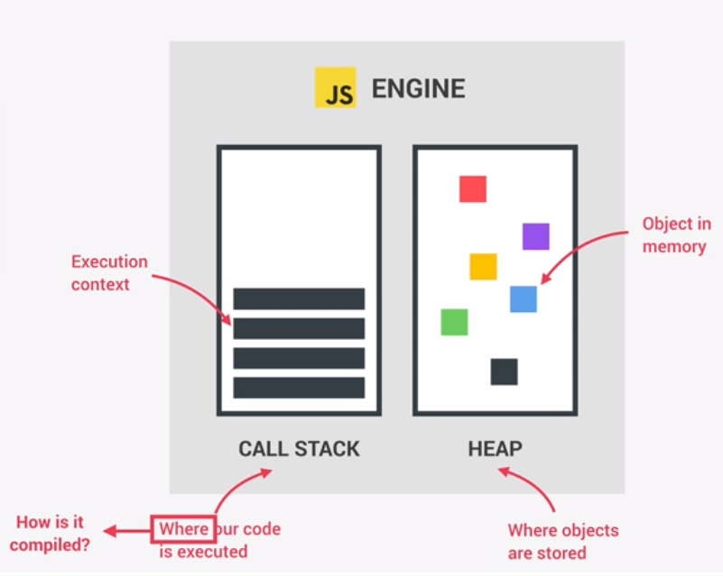
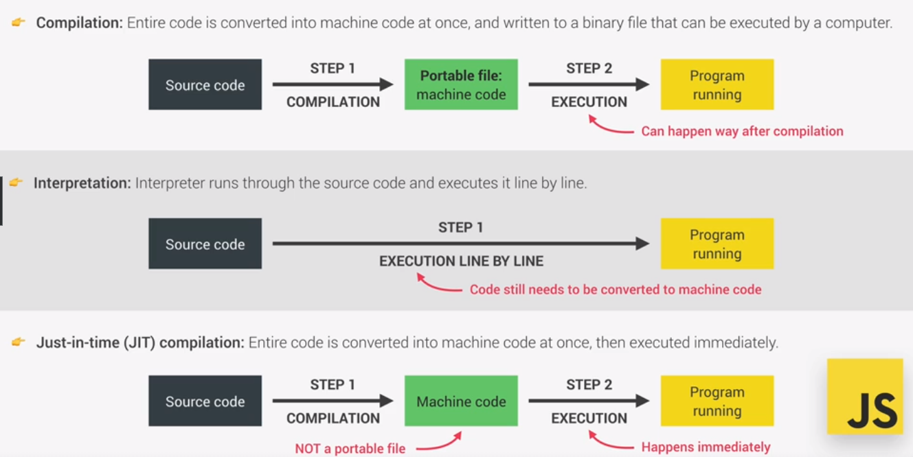
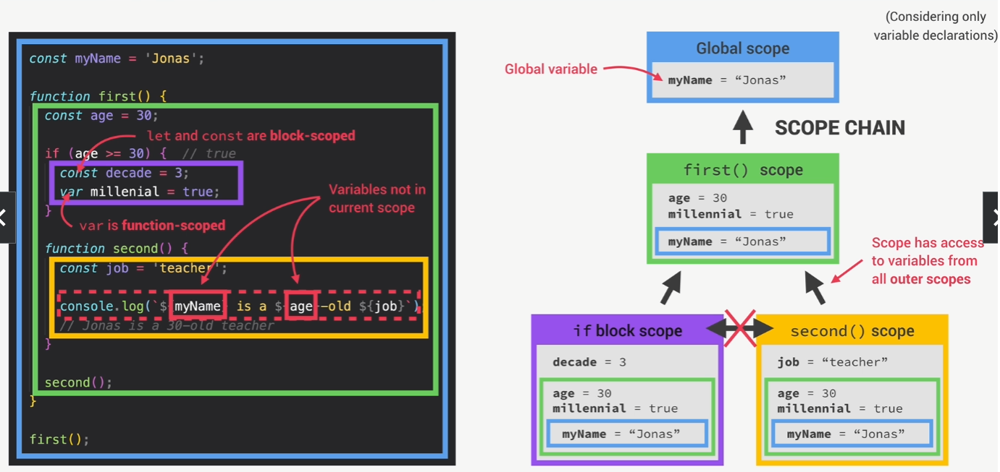

# JAVASCRIPT NOTES

## Javascript Data Types

1) Number- Floating point numbers ,Used for decimals and integers alike.
2) String- Sequence of characters, Used for text, the yare enclosed single or double 
quotees.
3) Boolean- Logical type that can only be true or false used for decisions.
4) Undefined- Value taken by a variable that is not defined yetundefined is both a type and a value.
5) Null- Also means 'empty value' however the Null is the type object.
6) Symbol- Value that is unique and cannot be changed (deprecated). 
7) BigInt- Larger Integers tham the Number type can hold

## Let,Const, Var
1)let- 
* used to declare variables that can be re-assigned (mutated) runtime of program.
* used when we need to declare a non initialized variable.
* use only when really sure of change in value.
            
2)const-
* used to declare variables that cannot be re-assigned during runtime(immutable)
* we cannot declare empty, unitialized const variables.
* use const preferably.
            
3)var-
* Old way of defining variables.
* works almost similar to let.
* usage should be avoided.           

## Basic Operators
There are different types of JavaScript operators:

* Arithmetic Operators
* Assignment Operators
* Comparison Operators
* String Operators
* Logical Operators
* Bitwise Operators
* Ternary Operators
* Type Operators   
### Arithmetic operators-
        +	Addition
        -	Subtraction
        *	Multiplication
        **	Exponentiation (ES2016)
        /	Division
        %	Modulus (Division Remainder)
        ++	Increment
        --	Decrement
### Assignment Operators-
        operator  example         same as
        =	        x = y	        x = y
        +=	        x += y	        x = x + y
        -=	        x -= y	        x = x - y
        *=	        x *= y	        x = x * y
        /=	        x /= y	        x = x / y
        %=	        x %= y	        x = x % y
        **=	        x **= y	        x = x ** y

### Comparison operators-
        ==	equal to
        ===	equal value and equal type
        !=	not equal
        !==	not equal value or not equal type
        >	greater than
        <	less than
        >=	greater than or equal to
        <=	less than or equal to
        ?	ternary operator

### String Operators-
        >,< Compare alphabetically
        +   Concatenation

**Adding number  and number will return the sum of the 2 numbers however adding a number and a string or 2 strings will give a concatenated string**

### Logical Operators-
        &&	logical and
        ||	logical or
        !	logical not

### Type Operators-
        typeof	Returns the type of a variable
        instanceof	Returns true if an object is an instance of an object type

### Bitwise Operators-
        Operator	Description	            Example	  Same as	Result	Decimal
            &	    AND	                    5 & 1	0101 & 0001	0001	 1
            |	    OR	                    5 | 1	0101 | 0001	0101	 5
            ~	    NOT	                    ~ 5	    ~0101	    1010	 10
            ^	    XOR	                    5 ^ 1	0101 ^ 0001	0100	 4
            <<	    left shift	            5 << 1	0101 << 1	1010	 10
            >>	    right shift	            5 >> 1	0101 >> 1	0010	  2
            >>>	    unsigned right shift	5 >>> 1	0101 >>> 1	0010	  2

### Ternary Operator=
        logic? ifTrue: ifFalse;

                             
## Strings and Template Literals
        
* Template literals are literals delimited with backtick (``) characters allowing for multi-line strings, string interpolation with expressions, and special constructs called tagged templates.

* Template literals are sometimes informally called template strings, they are used most commonly for string interpolation (to create strings doing substitution of placeholders). However, a tagged template literal not result in a string.
It can be used with a custom tag function to perform whatever operations want on the different parts of the template literal.

ex-

    const temp= 13; 
    const exString= `hello this is a template string and value of temp is ${temp}`

## Type Conversion and Coercion

`Type conversion is when we manually convert one data type into another.`

`Type coercion is when javascript converts a data type to another exconcatenation of string and Number.`
* To perform type conversion from strings to numbers we use Number() function.
* Number doesnt convert the input variable it returns a Number.
* When we try to convert a string that doesnt contain a number the Numberfunction returns NaN which stands for not a number
* To perform conversion from a Number to a string we use String() function.
* The function returns a String.

**Type coercion is bad practise**

## Truthy and Falsy values
        
        Falsy Values : 0,'',undefined,null,NaN.
        Truth Values : Everything else (including {}).

        Falsy values are type coerced to false in boolean ex- during if else statements.
        Truthy Values are type coerced to true.

## Equality Operators

        == : refers to a loose equality operator. it performs type coercion and then does comparison
        === : strict equality operator doesnt perform type coercion if the types are dissimilar it return false irrespective of value contained.

**Using of loose equality operator is bad practice**

## Switch statement

        switch(variable){
            case a:
                break;
            case b:
                break;
            default:

        }

## Statements and Expressions

* Expressions are lines of code that produce an output on their own eg 2+3;
* Statement doesnt produce and output value on its own eg let ex=32;

## To use Javascript in Strict mode
put 'use strict' at the start of the code

        'use strict';

**Strict mode helps us identfy bugs which would be legal but would cause our code to fail at its task or give us a wrong output**

## Functions
`Functions are pieces of code that are used to perform a certain task and these pieces are re-usable.`

* Functions also help improve readability and to increase code quality.

        // function definition
        function functionName(params){
            //function body
        }
        // function calls
        functionName(values);

* params are various variables or values that can be passed into a function to help perform the task.

* functions can also return values or results of the tasks so that it can be used as part of a greater task

        // function definition
        function functionName(params){
            //function body

            return result;
        }
        // function calls
        let result=functionName(values);
* **function need not have to accept any parameters**
* **functions need not return any values such functions are called void function**

### Function expressions

take a look at the code below

        // function definition method
        function calculateAge1(birthYear){
            return 2037-birthYear;
        }

        const age1= calculateAge(2002);

        //function expression method
        const age= function(birthYear){
            return 2037-birthYear;
        }

        const age2= age(2002);

**both these functions give the same result i.e age1===age2**

however there is a key difference between function definition method and function expression method and that is

`Functions that are defined using function definition can be called before the function is defined in the code thanks to hoisting, However function of  the function expression type cannot be called before they are declared`

### Arrow functions
`Arrow functions are just special cases of function expressions`

        const functionName = (parameterList)=>{
            //function body
            return result;
        }

        // for functions with single parameter and a single line of code
        // arrowfunctions can be modified as

        const functionName= parameter=>parameter*2;
        // this function takes in a parameter and returns the parameter multiplied by 2

**arrow functions are used as they reduce the syntax to be written**

### Functions calling other Functions
Let us consider the below code

        function cutFruitPieces(fruit){
            return fruit*4;
        }

        function fruitProcessor(apples,oranges){
            //nested function call
            const applePieces=cutFruitPieces(apples);
            const orangePieces=cutFruitPieces(oranges);

            const juice =`Juice with ${applePieces} pieces of apple and ${orangePieces} pieces of orange `;

            return juice;
        }

        console.log(fruitProcessor(2,3));

**Here we can see that the function fruitProcessor calls the cutFruitPieces function hence once the function is defined they can be used inside any other function**

### Default parameters

In functions we can set default values for parameters in case they are omitted during function call.

        function functionName(param1=val1,param2=val2){
            //function body
            return result;
        }
`In case param1 and param2 are passed to the function the values that are passed to the function are used however if any of the parameters are omitted in the function call the default values val1 and/or val2 are used instead`

**We the passed / omitted parameters should always be in the same order as the definition**

        let res=functionName(val2);
        // this function call assigns val2 to param1 and default value of param2
        //taken

### Pass by Value and Pass by Reference

 * `In pass by value a copy of the variable is passed into the function hence effectively passing only the value of the variable to the function.`
 * `In pass by value the variable itself is passed into the function hence any change made to the variable inside a function changes the value of the variable.`
**Since JS is an interpreted language that doesnt contain addressed memory we donot have pass by reference in JS.** 

### First class v/s Higher Class functions

1) First Class Functions
* Javascript threats functions as first-class citizens
* This means that functions are simply values
* Functions are just another 'type' of object

        function sayHello(){
            condole.log(`hello`);
        }

        console.log(sayHello); // Logs Object

2) Higher Order Functions
* A function that receives another function as an argument or returns a new function or does both.
* This is only possible because of first class functions.

        const greet=()=>{
            console.log(`Hey`);
        }
        btnClose.addEventListener('click',greet);
        //In this example a function greet is passed in as a call-back function as an
        // as an argument into addEventListener function.
        // Call-back functions are called at the end after the function reaches the
        // end of its execution

        function count(){
            let counter=0;
            return function(){
                counter++;
            }
        }
        const fn=count();
        //in this function a function is being returned;

### Call-back functions
`A callback function is a function passed into another function as an argument, which is then invoked inside the outer function to complete some kind of routine or action.`

Let us imagine the following scenario, we are developing a large codebase consisting of 1000+ functions. After every function is executed we need to log the execution result in the console we can do that by

        function abc(x){
            console.log(`function abc has been executed`);
            return 123+x;
        }

This is good enough for one function but for 1000+ functions it might become time consuming to write the same line again and again. Also if the logging string must be changed from 'function abc has been executed' to 'abc has been exexcuted successfully' we will have to make changes to 1000+ functions across multiple files and folders. Instead it might be easier to make it into function, that way we will have to make only one change.
    

        // this is the definition of the function we will use as a call back
        function logger(str){
            console.log(`${str} has been executed successfully`);
        }

        // this is the function that we need to log the execution
        function abc(x,callBackToLogger){
            callBackToLogger(abc.name);
            //abc.name returns 'abc' (.name is a property of functions  as they are objects)
            return 123+x;
        }

        //function call
        abc(2000,logger);
        // returns 2123 and logs abc has been executed successfully.

Call backs have many other applications as well.
* **Where callbacks really shine are in asynchronous functions, where one function has to wait for another function (like waiting for a file to load).**

### Functions that return Functions

        const greet=()=>{
            return function(name){
                console.log(`${greeting} ${name}`);
            }
        }

        const greetGuest= greet('Hey');
        greetGuest('Brendon Eichmann');
        //logs Hey Brendon Eichmann

        // This can also be written as
        greet('Hey')('Brendon Eichmann');

### Immediately Invoked Function Expression (IIFEs)
`Sometimes we require functions that will execute only once and immediately during its expression`
* This is extensively used in async\await

                //To write an IIFE
                (function(){
                        //function definition
                })();

                //Using arrow functions
                (()=>{
                        //function definition or task
                })();

## Arrays
`The Array object, as with arrays in other programming languages, enables storing a collection of multiple items under a single variable name, and has members for performing common array operations.`

In JavaScript, arrays aren't primitives but are instead Array objects with the following core characteristics:
- JavaScript arrays are resizable and can contain a mix of different data types. (When those characteristics are undesirable, use typed arrays instead.)
- JavaScript arrays are not associative arrays and so, array elements cannot be accessed using arbitrary strings as indexes, but must be accessed using nonnegative integers (or their respective string form) as indexes.
- JavaScript arrays are zero-indexed: the first element of an array is at index 0, the second is at index 1, and so on — and the last element is at the value of the array's length property minus 1.
- JavaScript array-copy operations create shallow copies. (All standard built-in copy operations with any JavaScript objects create shallow copies, rather than deep copies).

                //declaring arrays in Javascript
                const arr=['Hello','There','General','Kenobi'];

                //Arrays can contain a mix of data types
                const mix=[1,'hey',['a',2,3],{
                        age:21,
                        height:181.
                        weight:65
                }];

                // Here the array mix contain different data types such
                //as string ,Number, Array and ,Object

                //Javascript elements can be accessed only using indices
                //and Square bracket Notation

                console.log(arr[0]);
                //logs Hello

                let eg=0;
                console.log(arr[eg]);
                //ILLEGAL

                //Event though an array is declared using const it is
                //immutable but the variable cannot be re-assigned

                mix[2]='This is to calculate BMI';
                //Legal

                mix=[1,2,3];
                //ILLEGAL

### Array properties
- Length- The length property of an array defines the umber of elements in the array. To access this property we use

                const arr= [1,2,3,4];
                console.log(arr.length);
                //logs 4 in the console

### Array Methods
- Concat- The concat() method of Array instances is used to merge two or more arrays. This method does not change the existing arrays, but instead returns a new array.

                const array1 = ['a', 'b', 'c'];
                const array2 = ['d', 'e', 'f'];
                const array3 = array1.concat(array2);

                console.log(array3);
                // Expected output: Array ["a", "b", "c", "d", "e", "f"];

- CopyWithin- copyWithin() method of Array instances shallow copies part of this array to another location in the same array and returns this array without modifying its length.

                const array1 = ['a', 'b', 'c', 'd', 'e'];

                // Copy to index 0 the element at index 3
                console.log(array1.copyWithin(0, 3, 4));
                // Expected output: Array ["d", "b", "c", "d", "e"]

                // Copy to index 1 all elements from index 3 to the end
                console.log(array1.copyWithin(1, 3));
                // Expected output: Array ["d", "d", "e", "d", "e"]

- Every- The every() method of Array instances tests whether all elements in the array pass the test implemented by the provided function. It returns a Boolean value.

                const isBelowThreshold = (currentValue) => currentValue < 40;

                const array1 = [1, 30, 39, 29, 10, 13];

                console.log(array1.every(isBelowThreshold));
                // Expected output: true

- Filter- The filter() method of Array instances creates a shallow copy of a portion of a given array, filtered down to just the elements from the given array that pass the test implemented by the provided function.

                const words = ['spray', 'limit', 'elite', 'exuberant', 'destruction', 'present'];

                const result = words.filter((word) => word.length > 6);

                console.log(result);
                // Expected output: Array ["exuberant", "destruction", "present"]

- Flat- The flat() method of Array instances creates a new array with all sub-array elements concatenated into it recursively up to the specified depth.

                const arr1 = [0, 1, 2, [3, 4]];

                console.log(arr1.flat());
                // expected output: Array [0, 1, 2, 3, 4]

                const arr2 = [0, 1, [2, [3, [4, 5]]]];

                console.log(arr2.flat());
                // expected output: Array [0, 1, 2, Array [3, Array [4, 5]]]

                console.log(arr2.flat(2));
                // expected output: Array [0, 1, 2, 3, Array [4, 5]]

                console.log(arr2.flat(Infinity));
                // expected output: Array [0, 1, 2, 3, 4, 5]

- Flat- The flatMap() method of Array instances returns a new array formed by applying a given callback function to each element of the array, and then flattening the result by one level. It is identical to a map() followed by a flat() of depth 1 (arr.map(...args).flat()), but slightly more efficient than calling those two methods separately.

                const arr1 = [1, 2, 1];

                const result = arr1.flatMap((num) => (num === 2 ? [2, 2] : 1));

                console.log(result);
                // Expected output: Array [1, 2, 2, 1]

- ForEach- The forEach() method of Array instances executes a provided function once for each array element.

                const array1 = ['a', 'b', 'c'];

                array1.forEach((element) => console.log(element));

                // Expected output: "a"
                // Expected output: "b"
                // Expected output: "c"

- IndexOf- The indexOf() method of Array instances returns the first index at which a given element can be found in the array, or -1 if it is not present.

                const beasts = ['ant', 'bison', 'camel', 'duck', 'bison'];

                console.log(beasts.indexOf('bison'));
                // Expected output: 1

                // Start from index 2
                console.log(beasts.indexOf('bison', 2));
                // Expected output: 4

                console.log(beasts.indexOf('giraffe'));
                // Expected output: -1

- lastIndexOf- The lastIndexOf() method of Array instances returns the last index at which a given element can be found in the array, or -1 if it is not present. The array is searched backwards, starting at fromIndex.

                const animals = ['Dodo', 'Tiger', 'Penguin', 'Dodo'];

                console.log(animals.lastIndexOf('Dodo'));
                // Expected output: 3

                console.log(animals.lastIndexOf('Tiger'));
                // Expected output: 1

- Splice- The splice() method of Array instances changes the contents of an array by removing or replacing existing elements and/or adding new elements in place.

                const months = ['Jan', 'March', 'April', 'June'];
                months.splice(1, 0, 'Feb');
                // Inserts at index 1
                console.log(months);
                // Expected output: Array ["Jan", "Feb", "March", "April", "June"]

                months.splice(4, 1, 'May');
                // Replaces 1 element at index 4
                console.log(months);
                // Expected output: Array ["Jan", "Feb", "March", "April", "May"]

**To create a new array with a segment removed and/or replaced without mutating the original array, use toSplice()To access part of an array without modifying it, see slice().**

- Sort- The sort() method of Array instances sorts the elements of an array in place and returns the reference to the same array, now sorted. The default sort order is ascending, built upon converting the elements into strings, then comparing their sequences of UTF-16 code units values.

                const months = ['March', 'Jan', 'Feb', 'Dec'];
                months.sort();
                console.log(months);
                // Expected output: Array ["Dec", "Feb", "Jan", "March"]

                const array1 = [1, 30, 4, 21, 100000];
                array1.sort();
                console.log(array1);
                // Expected output: Array [1, 100000, 21, 30, 4]

**The time and space complexity of the sort cannot be guaranteed as it depends on the implementation.To sort the elements in an array without mutating the original array, use toSorted()**

- Slice- The slice() method of Array instances returns a shallow copy of a portion of an array into a new array object selected from start to end (end not included) where start and end represent the index of items in that array. The original array will not be modified.

                const animals = ['ant', 'bison', 'camel', 'duck', 'elephant'];

                console.log(animals.slice(2));
                // Expected output: Array ["camel", "duck", "elephant"]

                console.log(animals.slice(2, 4));
                // Expected output: Array ["camel", "duck"]

                console.log(animals.slice(1, 5));
                // Expected output: Array ["bison", "camel", "duck", "elephant"]

                console.log(animals.slice(-2));
                // Expected output: Array ["duck", "elephant"]

                console.log(animals.slice(2, -1));
                // Expected output: Array ["camel", "duck"]

                console.log(animals.slice());
                // Expected output: Array ["ant", "bison", "camel", "duck", "elephant"]

- Some- The some() method of Array instances tests whether at least one element in the array passes the test implemented by the provided function. It returns true if, in the array, it finds an element for which the provided function returns true; otherwise it returns false. It doesn't modify the array.

                const array = [1, 2, 3, 4, 5];

                // Checks whether an element is even
                const even = (element) => element % 2 === 0;

                console.log(array.some(even));
                // Expected output: true

- Reverse- The reverse() method of Array instances reverses an array in place and returns the reference to the same array, the first array element now becoming the last, and the last array element becoming the first. In other words, elements order in the array will be turned towards the direction opposite to that previously stated.

                const array1 = ['one', 'two', 'three'];
                console.log('array1:', array1);
                // Expected output: "array1:" Array ["one", "two", "three"]

                const reversed = array1.reverse();
                console.log('reversed:', reversed);
                // Expected output: "reversed:" Array ["three", "two", "one"]

                // Careful: reverse is destructive -- it changes the original array.
                console.log('array1:', array1);
                // Expected output: "array1:" Array ["three", "two", "one"]

**To reverse the elements in an array without mutating the original array, use toReversed().**

- ReduceRight- The reduceRight() method of Array instances applies a function against an accumulator and each value of the array (from right-to-left) to reduce it to a single value.

                const array1 = [
                [0, 1],
                [2, 3],
                [4, 5],
                ];

                const result = array1.reduceRight((accumulator, currentValue) => accumulator.concat(currentValue));

                console.log(result);
                // Expected output: Array [4, 5, 2, 3, 0, 1]

- Reduce- The reduce() method of Array instances executes a user-supplied "reducer" callback function on each element of the array, in order, passing in the return value from the calculation on the preceding element. The final result of running the reducer across all elements of the array is a single value.

                const array1 = [1, 2, 3, 4];

                // 0 + 1 + 2 + 3 + 4
                const initialValue = 0;
                const sumWithInitial = array1.reduce((accumulator, currentValue) => accumulator + currentValue, initialValue);

                console.log(sumWithInitial);
                // Expected output: 10

- Map- The map() method of Array instances creates a new array populated with the results of calling a provided function on every element in the calling array.

                const array1 = [1, 4, 9, 16];

                // Pass a function to map
                const map1 = array1.map((x) => x * 2);

                console.log(map1);
                // Expected output: Array [2, 8, 18, 32]

## Javascript Objects

`JavaScript is designed on a simple object-based paradigm. An object is a collection of properties, and a property is an association between a name (or key) and a value. A property's value can be a function, in which case the property is known as a method.`

Objects in JavaScript, just as in many other programming languages, can be compared to objects in real life. In JavaScript, an object is a standalone entity, with properties and type. Compare it with a cup, for example. A cup is an object, with properties. A cup has a color, a design, weight, a material it is made of, etc. The same way, JavaScript objects can have properties, which define their characteristics.

- You can create an object using an object initializer.

                const obj = {
                property1: value1, // property name may be an identifier
                2: value2, // or a number
                "property n": value3, // or a string
                };

**Each property name before colons is an identifier (either a name, a number, or a string literal), and each valueN is an expression whose value is assigned to the property name. The property name can also be an expression; computed keys need to be wrapped in square brackets. The object initializer reference contains a more detailed explanation of the syntax.**

- Alternatively, you can first create a constructor function and then instantiate an object by invoking that function with the new operator.

Define the object type by writing a constructor function. There is a strong convention, with good reason, to use a capital initial letter.
- Create an instance of the object with new.
- To define an object type, create a function for the object type that specifies its name, properties, and methods. For example, suppose you want to create an object type for cars. You want this type of object to be called Car, and you want it to have properties for make, model, and year. To do this, you would write the following function:

                function Car(make, model, year) {
                        this.make = make;
                        this.model = model;
                        this.year = year;
                }

                const myCar = new Car("Eagle", "Talon TSi", 1993);

### Accessing Properties Dot Notation v/s Bracket Notation

`Javascript allows us to use 2 methods to access properties of objects those being dot notation and bracket notation`

- In dot notation we use the Name of the object (or name of instance of object) followed by a . and then the property name to access the property. ex-

                const car={
                        make: 'santro',
                        model: 'xs100',
                        year: '2002'                        
                }

                console.log(car.make)
                /logs santro

- In bracket notation we use the Name or the name of instance of the object followed by the property name passed into a pair of square brackets as a string;

        console.log(car['make']);
        //logs santro

**We can also use expressions within the square brackets**

        const str='model';

        console.log(car[model])
        //logs xs100

**When we try to access a property that doesnt exist we get undefined**

- To add new properties to our objects we can use both dot and object notation.

                //using dot notation
                car.mileage=100;

                //using bracket notation
                car['mileage']=100;

### Methods
`Methods in javascript are properties that contain functions. They can hence be used to perform tasks on that object`

-  We can add functions as properties in javascript objects. This is due to the fact that in Javascript functions are considered expressions.

                //To add methods to objects

                const obj={
                        functionName: function(){
                                //function expression
                        }
                }

                //ex-

                const imaginaryNumber={
                        realPart: 10,
                        imaginaryPart:2,
                        printNumber: function(){
                                console.log(`${realPart}+i${imaginaryPart}`);
                        }
                }

                //to use printNumber Method

                imaginaryNumber.printNumber();

## Loops

`Loops are used to perform repetitive logic or tasks`

### For Loops

`A for loop repeats until a specified condition evaluates to false. The JavaScript for loop is similar to the Java and C for loop.`

A for statement looks as follows:

                for (initialization; condition; afterthought)
                  statement

                  //example 

                for(let i=0;i<10;i++){
                        console.log(i);
                }

### Do.....While Loop

`The do...while statement repeats until a specified condition evaluates to false like a for loop with one fundamental difference i.e the do while loop is guarenteed to execute atleast once`

The do while loop looks like the following-

                do
                 statement
                while (condition);

                //example

                let i = 0;
                do {
                 i += 1;
                 console.log(i);
                } while (i < 5);

### While Loop

`A while statement executes its statements as long as a specified condition evaluates to true. While loops are often used when the number of possible iterations are not known. When the number of iterations possible are known a for loop is preffered`

A while loop looks like this-

                while (condition)
                        statement

                //example

                let n = 0;
                let x = 0;
                while (n < 3) {
                        n++;
                        x += n;
                }

### For.....In Loop

`The for...in statement iterates a specified variable over all the enumerable properties of an object. For each distinct property, JavaScript executes the specified statements.`

                for (variable in object)
                        statement

for example-

                function dumpProps(obj, objName) {
                        let result = "";
                        for (const i in obj) {
                        result += `${objName}.${i} = ${obj[i]} `;
                }
                        result += "
";
                        return result;
                }

**Although it may be tempting to use this as a way to iterate over Array elements, the for...in statement will return the name of your user-defined properties in addition to the numeric indexes.Therefore, it is better to use a traditional for loop with a numeric index when iterating over arrays, because the for...in statement iterates over user-defined properties in addition to the array elements, if you modify the Array object (such as adding custom properties or methods).**

### For.......of Loop

`The for...of statement creates a loop Iterating over iterable objects (including Array, Map, Set, arguments object and so on), invoking a custom iteration hook with statements to be executed for the value of each distinct property.`

                for (variable of object)
                          statement

for example

                const arr = [3, 5, 7];
                        arr.foo = "hello";

                        for (const i in arr) {
                        console.log(i);
                }
                // "0" "1" "2" "foo"

                for (const i of arr) {
                        console.log(i);
                }
                // Logs: 3 5 7

## Javascript Behind the Scenes

`Javascript is a high-Level, Prototype-based Object-Oriented, Multi-Paradigm, Interpreted or just-in-time compiled, Dynamic, Single-Threaded, Garbage Collected Programming language with first-class functions and a non-blocking event loop concurrency model`

* High Level Language is a Language wherein memory management is not manual. 
* Javascript has a garbage collector which frees memory taken up by variables and objects after they have served their purpose.
* Interpreted or just in time compiled in the sense that the code is compiled into machine code just before execution or is interepreted.
* A Paradigm is an approach and mindset of stucturing code,which will direct your coding style and technique. Javascript is a multi paradigm Language The 3 types of paradigms are.

        1) Procedural programming.
        2) Object oriented programming
        3) Functional programming

* Prototype based Object oriented language means that everything apart from primitive values are objects.
* Javscript is a language with first class language in the sense that functions are considered objects and hence can be passed into functions and also return functions
* Javascript is a dynamically typed language which means that a variable can hold values of more than one data type throughout its runtime. Hence the type of variable is dynamic.
* Typescript adds static type to javascript.
* Concurrency model is how the Javascript engine handles multiple tasks happening at the same time. 
* We need this because Javascript runs in one single thread so it can only do one thing at a time.
* If we have a task that takes time to execute such as fetching data from a server it would block the execution of the single thread until the task is completed hence we need non-blocking behaviour in our language.
* By using an event loop Javascript takes long running tasks and executes them in the background and puts them back in the main thread once they are finished.

### Javascript engine and runtime

* Every browser has its own javascript engine but the most popular one in is the v8 engine used in chrome.

* Node js is also a javascript runtime however its not available in browser

* The call stack is the place where our code is executed using the Execution context.
* The heap is an unstructured memory pool where all our user created objects are stored.

### Compilation v/s Interpretation v/s Just-In-Time (JIT) compilation

* Compilation is where the entire code is converted into machine code at once and is written to a binary file that  can be executed by a computer.

* Interpretation is when the interpreter runs through the source code and executes it line by line.

Interpreted languages have higher execution time and are much slower than compiled languages.

* JIT Compilation is where the entire code is converted into machine code at once and the n executed immediately.

**JAVASCRIPT IS A JIT COMPILED LANGUAGE**

### JIT Compilation process

1. First code is parsed and converted into a data structure called the Abstract Syntax Tree (AST). This works by splitting up keywords and variable names and places them in the tree.

2. Next, the generated AST is then compiled to machine code.

3. Then, the code is executed immediately. During execution the code is continuously updated with  Optimized code, thus making engines such as V8 engines are quick.

### Runtime in a Browser

`A Run Time Environment contains all the things necessary to run Javascript`

Browser runtime contains-

1. Javascript Engine.
2. Web APIs such as DOM, Timers, Fetch API these are not a part of the Javascript Language but they are provided by the Web APIs in the Browser Runtime.
3. Callback Queue is where all the callback functions are stored until they are called inside the function that is being executed. When they are called the event loop takes a function from the callback queue and places it in the call stack.

### Runtime outside a browser (Node js)

The Nodejs runtime is similar to the browser runtime but it doesnt contain any Web APIs. Instead it contains C++ bindings and a Thread Pool

### Execution Contexts and the Call Stack

`Execution context (EC) is an environment in which a piece of JavaScript is executed. Stores all the necessary information for some code to be executed`

- After compilation a Global execution context is created for Top level code. There is exactly one Global execution context (EC). It is a default context created for code that is not inside any function.
- Next top level code is executed inside the global EC.
- When functions are called a new EC is created that contains all the variables and information necessary to execute that function.
- These make up the Call stack.

What is inside a call stack??
1. Variable Environment- contains info about all the variables declared and used inside the function. Variables outside the function also can be used. Also contains the arguments object(keyword)

2. Scope chain- Contains information about the scope of each variable and function.

3. this keyword.

**All these are generated during CREATION phase**

**EC belonging to arrow function dont get the arguments keyword and the this Keyword**

`The Call Stack is a memory space wherein each execution contexts is stacked one upon another. When ever a new EC is created it is placed on top off the call stack and as soon as the execution of the function is over it is popped of the stack.`

#### Scope Chain
`Scoping defines where we can access a certain variable and where we cannot`
- There are 3 types of scopes in Javascript
1. Global Scope- contains all the variables that are not declared in any function or block.
2. Function Scope- Contains all the variables that have been declared within that particular function.
3. Block scope- its an ES6 feature containing all the variables declared within a curly braces {} ex- in an if statement or a loop.

- `Let and const are block scoped whereas var is function scoped which means that even if a variable is declared using var within a block it is still accessible within that function unlike let and const.`

- In Javascript we have Lexical scoping, so the rules of where we can access variables are based on exactly where in the code they are declared.
- Every scope always has access to all the variables from from all its outer scopes.**This is called the Scope Chain**.
- When a variable is out of the current scope the engine looks up in the scope chain until it finds the variable its looking for. This is called variable lookup.
- Scope chain is a onew way street a scope will never ever have access to the variables of an inner scope.
- The scope chain of a certain scope isequal to adding up together all the varaiable environments of all the parent scopes.
- Scope chain has nothing to do with the orrder in which functions were called.

